# Instructivo de uso - Pedido Máquina Backup

## 1. Portada

**Aplicación:** Pedido Máquina Backup  
**Tipo de documento:** Instructivo funcional de usuario  
**Destinatarios:** Supervisor, Depósito, Administrador, Coordinador, Consultor y Taller  
**Uso:** Interno  
**Última actualización:** Julio 2026

Este documento explica cómo utilizar la aplicación Pedido Máquina Backup desde el punto de vista del usuario final. Está orientado a la operación diaria y no a tareas técnicas o de desarrollo.

## 2. Objetivo del instructivo

Brindar una guía clara para que cada usuario pueda:

1. Ingresar al sistema correctamente.
2. Identificar qué funciones tiene habilitadas según su rol.
3. Ejecutar las tareas habituales paso a paso.
4. Interpretar estados de pedidos, máquinas, vehículos, eventuales y taller.
5. Registrar movimientos con criterios consistentes y trazables.
6. Consultar la información histórica necesaria para auditoría operativa.

## 3. Descripción general de la aplicación

Pedido Máquina Backup es una aplicación web interna utilizada para organizar la operación de máquinas, vehículos, pedidos, préstamos, eventuales, seguros y movimientos de taller.

El sistema permite:

- Centralizar solicitudes de máquinas.
- Controlar disponibilidad, estado y asignación de máquinas.
- Registrar préstamos entre supervisores.
- Gestionar vehículos, seguros, conductores y vencimientos.
- Registrar ingresos y egresos de taller para máquinas y vehículos.
- Administrar eventuales, componentes utilizados, trabajos realizados y servicios extras.
- Consultar inventario y operación desde roles de lectura.
- Mantener historial de acciones para auditoría.
- Exportar e importar información mediante Excel cuando el módulo lo permite.

En términos generales, los flujos principales son:

1. Un Supervisor crea un pedido de máquinas.
2. Depósito o un Supervisor receptor prepara y entrega las máquinas.
3. Quien recibió las máquinas registra la devolución cuando finaliza el uso.
4. El receptor confirma la devolución y el pedido queda cerrado, o se registran faltantes.
5. Administración mantiene inventario, usuarios, servicios, vehículos, seguros, tipos, amortizaciones y eventuales.
6. Taller registra ingresos y egresos de máquinas o vehículos, con historial.
7. Coordinación y Consultoría consultan información operativa según permisos.

## 4. Acceso al sistema

### 4.1 Ingreso

Para ingresar:

1. Abrir la aplicación en el navegador.
2. Completar el campo **Usuario**.
3. Completar el campo **Contraseña**.
4. Presionar **Entrar**.

Si las credenciales son incorrectas, el sistema muestra el mensaje **Usuario o contraseña incorrectos**.

### 4.2 Inicio del sistema

Antes de mostrar el login puede aparecer una pantalla con el mensaje **Iniciando aplicación...**. Si sucede:

1. Esperar unos segundos.
2. Si no avanza, presionar **Reintentar**.

### 4.3 Redirección por rol

Una vez autenticado, el sistema redirige automáticamente según el rol:

- **Supervisor:** panel del supervisor.
- **Depósito:** panel de depósito.
- **Administrador:** panel de administración.
- **Coordinador:** panel de coordinación.
- **Consultor:** panel de consultoría.
- **Taller:** panel de taller.

### 4.4 Menú superior

Los roles que usan el panel administrativo o de depósito cuentan con un menú superior. Según el rol, puede mostrar accesos a:

- Inicio.
- Inventario: máquinas y vehículos.
- Operaciones: taller, pedidos y eventuales.
- Configuración: usuarios, servicios, supervisores por servicio y seguros.

El menú también muestra el usuario conectado, el rol y la opción **Salir**.

### 4.5 Notificaciones

Dentro del sistema se pueden visualizar notificaciones desde el ícono de campana. Allí se informan novedades relevantes, por ejemplo:

- Pedido creado.
- Pedido preparado.
- Pedido entregado.
- Devolución registrada.
- Estado actualizado.
- Solicitud de cancelación.

## 5. Roles del sistema

Los roles activos contemplados por la aplicación son los siguientes:

| Rol | Objetivo principal | Funciones principales |
| --- | --- | --- |
| Supervisor | Solicitar máquinas y consultar su operación | Crear pedidos, gestionar préstamos recibidos, registrar devoluciones, consultar sus máquinas, vehículos y eventuales |
| Depósito | Gestionar preparación, entrega y control de pedidos | Ver pedidos operativos, asignar máquinas, confirmar devoluciones, consultar máquinas por servicio y supervisor |
| Administrador | Mantener el sistema y controlar la operación global | Gestionar usuarios, servicios, máquinas, vehículos, seguros, pedidos, taller, eventuales, tipos y amortizaciones |
| Coordinador | Consultar operación y completar finalizaciones habilitadas | Ver inventario, taller y eventuales; finalizar eventuales cuando corresponde |
| Consultor | Consultar información operativa | Ver inventario, taller, eventuales, servicios y asignaciones sin editar |
| Taller | Operar movimientos de taller | Consultar máquinas y vehículos, registrar ingresos y egresos de taller |

### 5.1 Mapa general de accesos por rol

| Módulo / función | Supervisor | Depósito | Administrador | Coordinador | Consultor | Taller |
| --- | --- | --- | --- | --- | --- | --- |
| Login y sesión | Sí | Sí | Sí | Sí | Sí | Sí |
| Notificaciones | Sí | Sí | Sí | Sí | Sí | Sí |
| Crear pedidos | Sí | No | No | No | No | No |
| Mis pedidos | Sí | No | No | No | No | No |
| Mis préstamos | Sí | Operación compartida en préstamos | No | No | No | No |
| Pedidos a gestionar | No | Sí | No | No | No | No |
| Ver todos los pedidos | No | No | Sí | No | No | No |
| Editar pedidos desde administración | No | No | Sí | No | No | No |
| Aprobar o marcar cancelación | No | No | Sí | No | No | No |
| Registrar devolución | Sí | Devolución directa cuando corresponde | No | No | No | No |
| Confirmar devolución | En préstamos recibidos | Sí | No | No | No | No |
| Completar faltantes | Sí, cuando el pedido cerrado tiene faltantes | Según contexto operativo | No | No | No | No |
| Mis máquinas | Sí | No | No | No | No | No |
| Máquinas de depósito | No | Sí | No | No | No | No |
| Inventario de máquinas | No | No | Alta/edición/importación/exportación | Lectura | Lectura | Lectura y acciones de taller |
| Movimientos masivos de máquinas entre servicios | No | No | Sí | No | No | No |
| Tipos de máquina | No | No | ABM y referencias | Lectura | Lectura | Lectura |
| Referencias por tipo | No | No | Cargar, editar, eliminar, ver | Ver | Ver | Ver |
| Plazos de amortización | No | No | ABM | Lectura | Lectura | Lectura |
| Panel de amortizaciones | No | No | Recalcular y consultar | Lectura | Lectura | Lectura |
| Mis vehículos | Sí | No | No | No | No | No |
| Inventario de vehículos | No | No | Alta/edición/importación/exportación | Lectura | Lectura | Lectura y acciones de taller |
| Asignación de conductor | No | No | Sí | No | No | No |
| Seguros | No | No | ABM | No | No | No |
| Taller | No | No | Registrar y consultar | Consultar | Consultar | Registrar y consultar |
| Eventuales | Mis eventuales y observaciones | No | Alta, corrección, baja lógica, PDF | Lectura y finalización | Lectura | No |
| Servicios | No | Catálogo de lectura | ABM y baja lógica | No | Lectura | No |
| Supervisores x Servicios | No | No | Edición | No | Lectura | No |
| Usuarios | No | No | ABM, roles, activación y carnet | No | No | No |

### 5.2 Diferencias entre roles de lectura y roles operativos

- **Administrador** puede editar la mayor parte de los catálogos y ejecutar acciones administrativas.
- **Supervisor** opera pedidos propios, préstamos recibidos, devoluciones y observaciones sobre sus eventuales.
- **Depósito** opera pedidos con destino Depósito y consulta inventario relacionado con servicios y supervisores.
- **Taller** no administra datos maestros, pero puede registrar ingresos y egresos de taller.
- **Coordinador** y **Consultor** son principalmente roles de consulta. Coordinador además tiene una acción específica de finalización de eventuales.

## 6. Funcionalidades del rol Supervisor

### 6.1 Panel principal

Al ingresar como Supervisor, el usuario visualiza accesos a:

- **Mis máquinas**: consulta de máquinas vinculadas a sus servicios o préstamos.
- **Mis vehículos**: consulta de vehículos asignados al usuario.
- **Mis pedidos**: pedidos creados por ese supervisor.
- **Mis préstamos**: pedidos que otros supervisores le realizaron.
- **Mis eventuales**: eventuales asignados a su supervisión.

### 6.2 Crear pedido de máquinas

Para crear un nuevo pedido:

1. Ingresar a **Mis pedidos**.
2. Presionar **Crear nuevo pedido**.
3. Elegir el destino:
   - **Depósito**.
   - **Supervisor**.
4. Seleccionar el servicio donde se utilizarán las máquinas.
5. Indicar la cantidad requerida por tipo de máquina.
6. Si hace falta un tipo no contemplado en la lista principal, agregarlo en la sección correspondiente.
7. Completar una observación si corresponde.
8. Si el destino es otro supervisor, seleccionar el supervisor receptor.
9. Presionar **Crear pedido**.

Consideraciones:

- El Supervisor solo puede seleccionar servicios que tenga habilitados.
- El sistema exige pedir al menos una máquina.
- El pedido queda registrado con estado inicial **PENDIENTE_PREPARACION**.

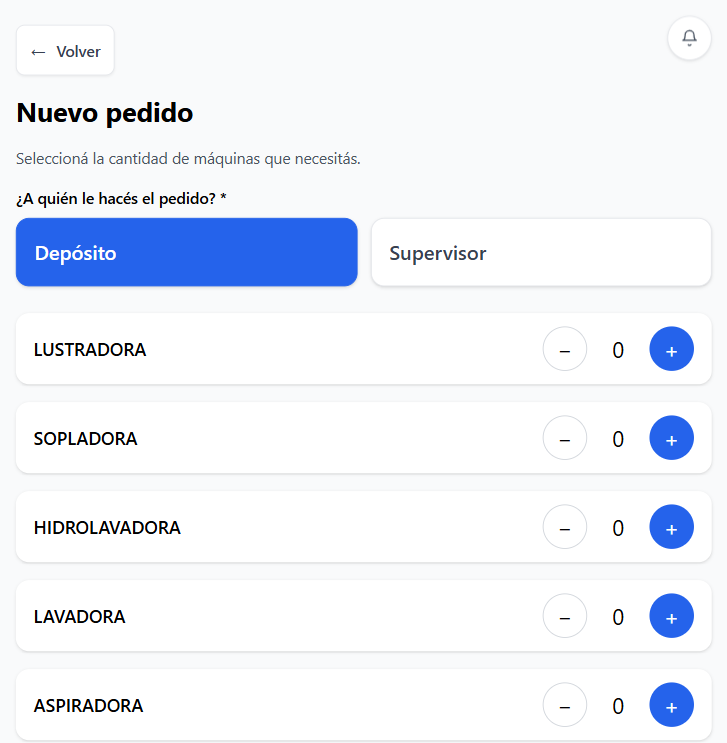

### 6.3 Consultar pedidos

En **Mis pedidos**, el Supervisor puede:

1. Ver los pedidos que creó.
2. Filtrar por estado.
3. Abrir un pedido para ver detalle.
4. Consultar historial de acciones.
5. Ver máquinas asignadas, resumen del pedido y observaciones.
6. Solicitar cancelación cuando el flujo lo permita.

Estados visibles con mayor frecuencia:

- **PENDIENTE_PREPARACION**.
- **PREPARADO**.
- **ENTREGADO**.
- **PENDIENTE_CONFIRMACION**.
- **CERRADO**.

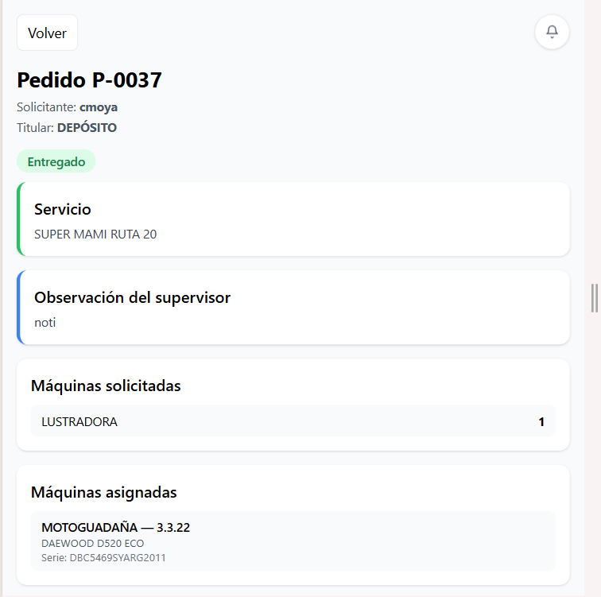

### 6.4 Gestionar préstamos entre supervisores

La aplicación contempla préstamos entre supervisores. En este caso, un supervisor solicita máquinas a otro supervisor en lugar de pedirlas a Depósito.

Para solicitar un préstamo:

1. Crear un pedido nuevo.
2. Seleccionar destino **Supervisor**.
3. Elegir el supervisor receptor.
4. Completar el resto del pedido.
5. Confirmar.

En **Mis préstamos**, el supervisor receptor puede:

1. Ver pedidos que otros supervisores le realizaron.
2. Filtrar por estado.
3. Abrir el detalle del préstamo.
4. Asignar máquinas si el pedido está pendiente.
5. Marcar el pedido como preparado.
6. Marcar el pedido como entregado.
7. Confirmar la devolución cuando las máquinas regresan.

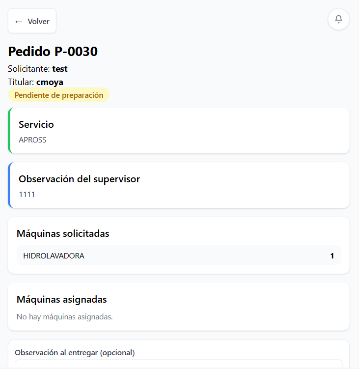

### 6.5 Registrar devolución

Cuando el pedido ya fue entregado, el Supervisor puede registrar la devolución.

Pasos:

1. Ingresar al detalle del pedido entregado.
2. Presionar **Registrar devolución**.
3. Marcar las máquinas efectivamente devueltas.
4. Revisar el total devuelto sobre el total asignado.
5. Si no se devuelve la totalidad, completar la justificación obligatoria.
6. Presionar **Confirmar devolución**.

Resultado esperado:

- El pedido pasa a **PENDIENTE_CONFIRMACION** para que el receptor confirme la devolución.
- Si hubo faltantes, queda trazabilidad para su posterior regularización.

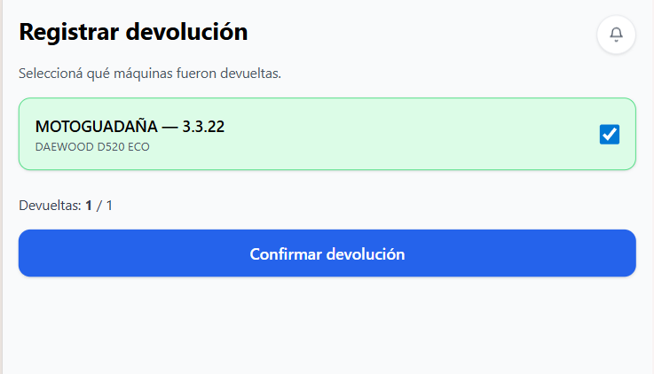

### 6.6 Consultar mis máquinas

En **Mis máquinas**, el Supervisor puede:

1. Consultar máquinas asociadas a sus servicios.
2. Ver máquinas temporales vinculadas a pedidos activos.
3. Filtrar por servicio, estado, tipo, código, modelo o serie.
4. Abrir el detalle de una máquina cuando la pantalla lo permita.

Esta vista es de consulta. La edición de máquinas corresponde a Administración.

La pantalla separa conceptualmente:

- **Máquinas fijas:** pertenecen a los servicios asignados al supervisor.
- **Máquinas temporales:** están vinculadas por un pedido o préstamo activo.
- **Máquinas fijas con movimiento:** pertenecen al supervisor, pero tienen un movimiento temporal asociado.

En cada registro se informa código, tipo, modelo, servicio original, servicio actual cuando corresponda y estado.

### 6.7 Consultar mis vehículos

En **Mis vehículos**, el Supervisor puede:

1. Ver vehículos asignados actualmente a su usuario.
2. Consultar datos de identificación, patente, modelo y seguro.
3. Filtrar por empresa y estado.
4. Buscar por patente, modelo, empresa o seguro.
5. Revisar póliza, tarjeta verde y pedido activo cuando corresponda.

La asignación o desasignación de conductor se realiza desde Administración.

### 6.8 Consultar mis eventuales

En **Mis eventuales**, el Supervisor puede:

1. Buscar eventuales asignados a su supervisión.
2. Filtrar por estado: activo, finalizado o cancelado.
3. Abrir el detalle del eventual.
4. Consultar componentes utilizados, vehículos, trabajos, servicios extras, fechas, observaciones e historial.
5. Agregar observaciones posteriores cuando el eventual está activo.

En el detalle se visualizan:

- Máquinas utilizadas por tipo y cantidad.
- Vehículos utilizados.
- Observaciones previas y posteriores.
- Historial de cambios.
- Datos legados de componentes cuando existan registros antiguos.

Si el eventual ya no está activo, la pantalla permite consulta, pero no carga de nuevas observaciones.

## 7. Funcionalidades del rol Depósito

### 7.1 Panel principal

El panel de Depósito muestra accesos a:

- **Máquinas**.
- **Pedidos a gestionar**.
- **Máquinas en Servicio**.
- **Máquinas por Supervisor**.

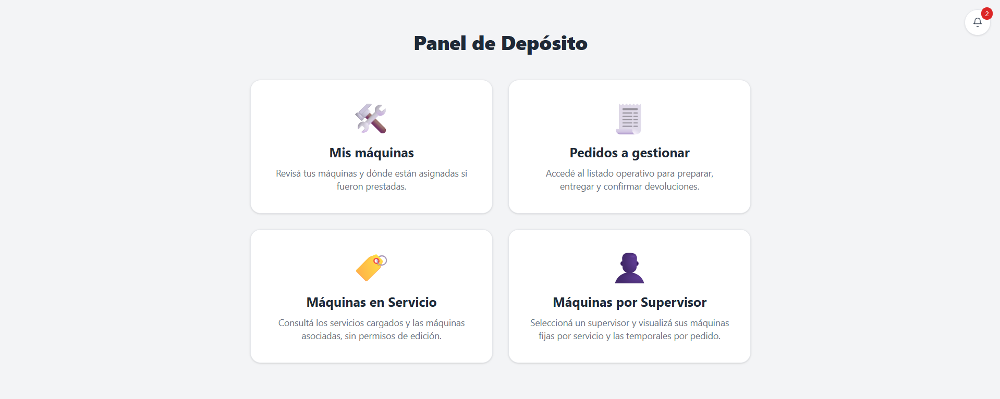

### 7.2 Visualizar pedidos pendientes

En **Pedidos a gestionar**, Depósito puede:

1. Ver pedidos con destino Depósito.
2. Filtrar por estado.
3. Abrir el detalle de cada pedido.
4. Revisar solicitante, titular, servicio, resumen e historial.

### 7.3 Asignar máquinas disponibles

Cuando un pedido está en **PENDIENTE_PREPARACION**, Depósito puede asignar máquinas.

Pasos:

1. Abrir el pedido.
2. Presionar **Asignar máquinas**.
3. Revisar cantidades solicitadas por tipo.
4. Filtrar máquinas por tipo o texto.
5. Seleccionar máquinas disponibles.
6. Si la asignación no coincide exactamente con lo solicitado, completar la justificación requerida.
7. Agregar observación si corresponde.
8. Confirmar la asignación.

Estados habituales:

- **Disponible**: se puede seleccionar.
- **Asignada**: no se puede seleccionar.
- **No devuelta**: no se puede seleccionar.
- **Fuera de servicio**: no se puede seleccionar.
- **Taller**: no se puede seleccionar.
- **Baja**: no se puede seleccionar.

Resultado esperado:

- Las máquinas quedan asociadas al pedido.
- El pedido pasa a **PREPARADO**.

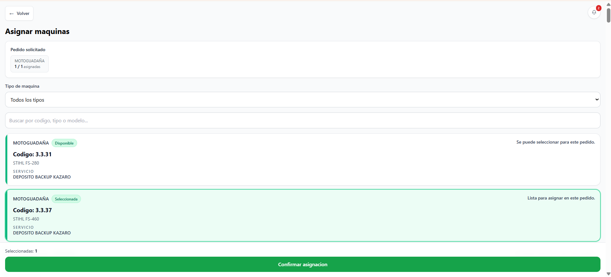

### 7.4 Marcar preparación y entrega

Desde el detalle del pedido, Depósito puede ejecutar acciones según el estado.

Si el pedido está en **PENDIENTE_PREPARACION**, puede marcarlo como **PREPARADO**. En la operatoria habitual, al asignar máquinas el pedido ya queda preparado.

Si el pedido está en **PREPARADO**, puede:

1. Completar observación opcional.
2. Presionar **Marcar como ENTREGADO**.

Resultado esperado:

- El pedido pasa a **ENTREGADO**.

### 7.5 Confirmar devolución

Cuando una devolución ya fue informada por el Supervisor, Depósito debe confirmarla.

Pasos:

1. Abrir un pedido en **PENDIENTE_CONFIRMACION** o **PENDIENTE_CONFIRMACION_FALTANTES**.
2. Presionar **Confirmar devolución**.
3. Verificar las máquinas listadas.
4. Marcar las máquinas efectivamente devueltas.
5. Completar observación si corresponde.
6. Confirmar.

Resultado esperado:

- Si todo fue devuelto, el pedido queda **CERRADO**.
- Si faltan máquinas, queda constancia de faltantes.

Si el pedido tuvo destino Depósito y el Supervisor todavía no cargó la devolución, la interfaz permite registrar una devolución directa desde Depósito cuando corresponde.

### 7.6 Consultar máquinas

En **Máquinas**, Depósito puede:

1. Revisar máquinas de sus servicios.
2. Identificar préstamos activos.
3. Filtrar por estado, servicio, tipo o texto.
4. Consultar el contexto operativo de una máquina.

La vista muestra todas las máquinas, pero resalta los préstamos activos principalmente sobre máquinas de los servicios vinculados al usuario de Depósito. También puede mostrar pedido activo, pedido no devuelto, servicio original y servicio de préstamo.

### 7.7 Consultar máquinas por servicio

En **Máquinas en Servicio**, Depósito accede a una vista de solo lectura.

Permite:

1. Buscar servicios.
2. Filtrar servicios con o sin máquinas asociadas.
3. Ordenar información.
4. Abrir el detalle de un servicio.
5. Consultar máquinas vinculadas a ese servicio.
6. Filtrar dentro del servicio por tipo, estado, código, modelo, serie o pedido activo.

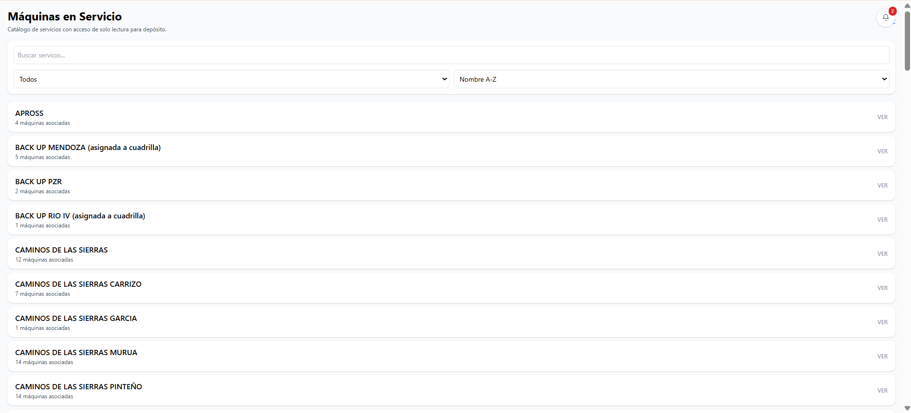

### 7.8 Consultar máquinas por supervisor

En **Máquinas por Supervisor**, Depósito puede:

1. Seleccionar un supervisor.
2. Ver servicios asignados.
3. Consultar **máquinas fijas** asociadas a sus servicios.
4. Consultar **máquinas temporales** asociadas a pedidos activos.
5. Identificar faltantes confirmados en pedidos cerrados.
6. Ver pedido, estado del pedido y supervisor solicitante de cada máquina temporal.

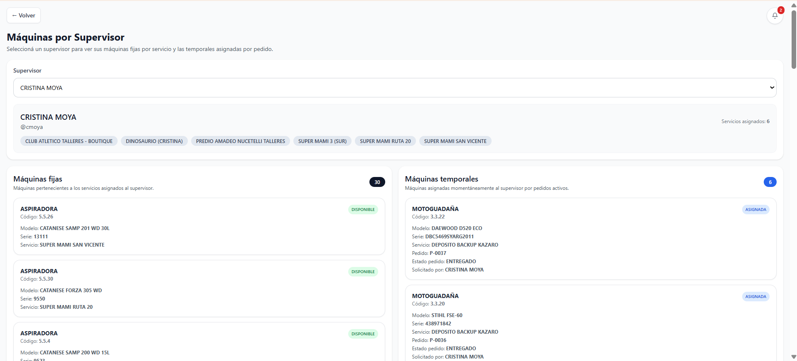

## 8. Funcionalidades del rol Administrador

### 8.1 Panel principal

El panel de Administración concentra los módulos de mantenimiento y auditoría:

- Máquinas.
- Vehículos.
- Taller.
- Pedidos.
- Eventuales.
- Usuarios.
- Servicios.
- Supervisores x Servicios.

### 8.2 Gestión de usuarios

En **Usuarios**, el Administrador puede:

1. Buscar por nombre o usuario.
2. Filtrar por rol.
3. Crear un usuario nuevo.
4. Editar un usuario existente.
5. Activar o desactivar usuarios.
6. Definir rol y contraseña.
7. Cargar vencimiento de carnet de conductor.

Roles válidos:

- **ADMIN**.
- **SUPERVISOR**.
- **DEPOSITO**.
- **COORDINADOR**.
- **CONSULTOR**.
- **TALLER**.

#### Crear usuario

Pasos:

1. Ingresar a **Usuarios**.
2. Presionar **+ Nuevo**.
3. Completar usuario, nombre completo, rol, contraseña y vencimiento de carnet si corresponde.
4. Presionar **Guardar**.

#### Editar usuario

Pasos:

1. Abrir un usuario del listado.
2. Modificar nombre, rol, contraseña o vencimiento de carnet.
3. Dejar la contraseña vacía si no se desea cambiarla.
4. Guardar.

#### Activar o desactivar usuario

Pasos:

1. Abrir el usuario.
2. Presionar **Desactivar usuario** o **Reactivar usuario**.
3. Confirmar la acción.

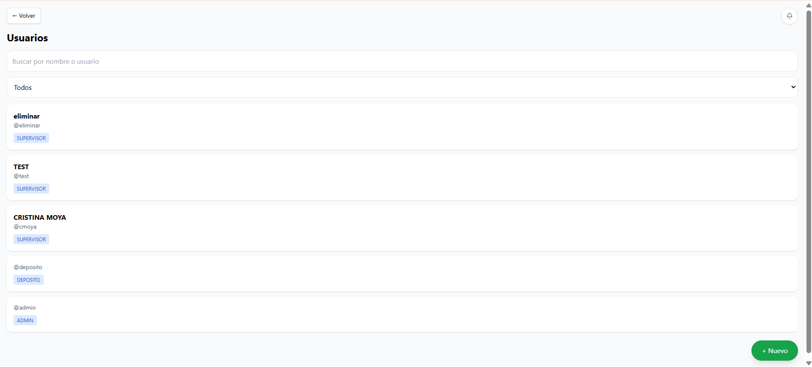

### 8.3 Gestión de servicios

En **Servicios**, el Administrador puede:

1. Buscar servicios.
2. Filtrar por cantidad de máquinas asociadas.
3. Crear servicios.
4. Editar servicios.
5. Dar de baja servicios cuando el sistema lo permita.
6. Ver máquinas vinculadas al servicio.
7. Filtrar máquinas del servicio por estado, tipo, código, modelo, serie o pedido activo.

La baja de servicio no elimina la trazabilidad histórica. El servicio queda oculto de listados operativos, pero los pedidos e historiales existentes se conservan.

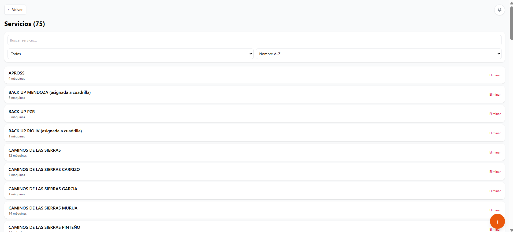

### 8.4 Asignación de servicios a usuarios operativos

En **Supervisores x Servicios**, el Administrador define qué servicios puede operar cada usuario habilitado.

Pasos:

1. Ingresar a **Supervisores x Servicios**.
2. Seleccionar un usuario.
3. Revisar servicios actualmente asignados.
4. Tildar o destildar servicios.
5. Presionar **Guardar asignación**.

Impacto operativo:

- Un Supervisor solo puede crear pedidos para servicios asignados.
- La asignación condiciona la consulta de máquinas por servicio.
- Consultor puede ver esta pantalla en modo lectura.

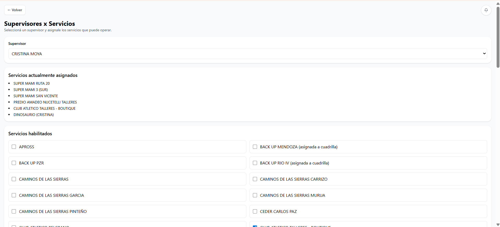

### 8.5 Gestión de máquinas

En **Máquinas**, el Administrador puede:

1. Buscar por código, tipo, modelo, serie o servicio.
2. Filtrar por tipo, estado y supervisor.
3. Ver resumen por estado.
4. Crear máquinas.
5. Editar máquinas.
6. Cambiar estado.
7. Eliminar máquinas.
8. Exportar a Excel.
9. Importar máquinas desde Excel.
10. Ejecutar movimientos masivos de servicio.
11. Acceder a tipos de máquina, plazos de amortización y panel de amortizaciones.
12. Enviar una máquina a taller o registrar su egreso de taller.
13. Consultar pedidos y servicios históricos de cada máquina.

Datos principales de una máquina:

- Código.
- Tipo.
- Modelo.
- Serie.
- Servicio actual.
- Estado.
- Fecha de compra.
- Empresa.
- Proveedor o factura.
- Año y antigüedad.
- Valores de referencia.
- Servicio para amortización.
- Comentarios.

En la edición de una máquina, si tiene asignación activa, se informa el servicio asociado y el pedido. También existe el acceso **Pedidos y servicios históricos**, donde se puede ver:

- Detalle completo de la máquina.
- Historial de pedidos donde participó.
- Ruta histórica de servicios.
- Tipo de movimiento de servicio: individual o masivo.
- Datos de compra, valuación y amortización.

Estados de máquina:

- **disponible**.
- **asignada**.
- **no_devuelta**.
- **fuera_servicio**.
- **taller**.
- **baja**.

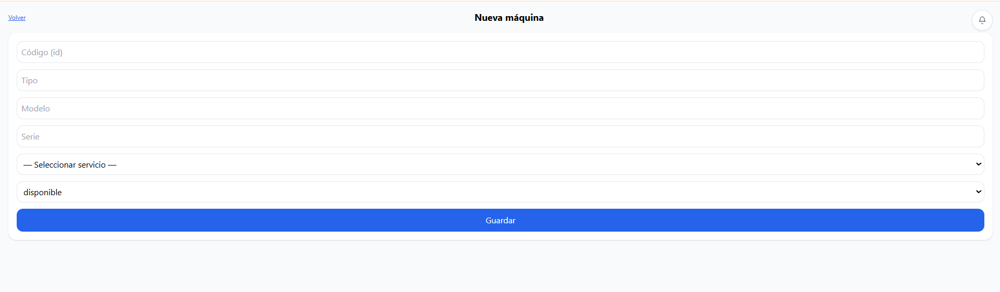

### 8.6 Importación y exportación de máquinas

Desde **Máquinas**, el Administrador puede:

1. Presionar **Exportar Excel** para descargar el inventario.
2. Presionar **Importar máquinas** para cargar un archivo `.xlsx`.
3. Descargar la plantilla.
4. Seleccionar el archivo.
5. Previsualizar la importación.
6. Confirmar la carga si no hay errores.

Reglas operativas:

- La importación acepta archivos `.xlsx`.
- El sistema valida datos antes de confirmar.
- La carga puede crear máquinas nuevas o actualizar existentes.
- Si hay errores, se muestran antes de aplicar cambios.

### 8.7 Movimientos masivos de máquinas entre servicios

Desde **Máquinas**, el Administrador puede usar **Movimientos masivos**.

Pasos:

1. Abrir **Movimientos masivos**.
2. Filtrar máquinas por texto, tipo, estado o servicio actual.
3. Seleccionar máquinas individuales o todas las filtradas.
4. Elegir el servicio destino.
5. Presionar **Confirmar movimiento**.
6. Revisar el resumen.
7. Confirmar.

El sistema informa:

- Cantidad seleccionada.
- Cantidad a mover.
- Máquinas sin cambios.
- Máquinas con pedido activo.

Si hay máquinas con pedido activo, el sistema solicita una confirmación adicional.

El movimiento masivo es transaccional: si no puede aplicarse correctamente, no debe quedar aplicado a medias. Cada máquina movida deja registro en su historial de servicios.

### 8.8 Tipos de máquina y referencias

En **Tipos de máquinas**, el Administrador puede:

1. Crear tipos.
2. Editar tipos existentes.
3. Eliminar tipos sin máquinas asociadas.
4. Buscar tipos.
5. Ver cantidad de máquinas asociadas.
6. Cargar y consultar referencias por tipo.

Las referencias son archivos asociados a un tipo de máquina. Sirven como material de consulta o respaldo. Pueden cargarse desde el botón **Cargar referencias** o abrirse desde **Ver referencias** en cada tipo.

En referencias por tipo se puede:

1. Seleccionar el tipo de máquina.
2. Cargar una o varias imágenes.
3. Agregar descripción obligatoria.
4. Confirmar la carga.
5. Ver referencias en carrusel.
6. Editar descripción o reemplazar imagen.
7. Eliminar referencias cuando corresponda.

Coordinador y Consultor pueden acceder a esta información en modo lectura.

### 8.9 Plazos y panel de amortización

En **Plazos de amortización**, el Administrador puede:

1. Crear un plazo con nombre y cantidad de meses.
2. Asociar tipos de máquina al plazo.
3. Editar plazos.
4. Eliminar plazos sin tipos asociados.
5. Buscar por nombre, meses o tipo.

Si un tipo ya estaba asociado a otro plazo, el sistema advierte que se reasignará.

En **Panel de amortizaciones**, el Administrador puede:

1. Recalcular estados de amortización.
2. Ver total de máquinas, amortizadas, no amortizadas y sin datos.
3. Filtrar por tipo, servicio, estado de máquina y estado de amortización.
4. Ver próximos vencimientos por ventana de meses.
5. Abrir el detalle de una máquina.

Estados de amortización:

- **AMORTIZADA**.
- **NO_AMORTIZADA**.
- **SIN_DATOS**.

### 8.10 Gestión de vehículos

En **Vehículos**, el Administrador puede:

1. Buscar por ID, empresa, patente, modelo, seguro o conductor.
2. Filtrar por estado, empresa, faltante, seguro o conductor.
3. Crear vehículos.
4. Editar vehículos.
5. Dar de baja vehículos.
6. Asignar o desasignar conductor.
7. Consultar historial de asignaciones.
8. Exportar a Excel.
9. Importar desde Excel.
10. Enviar o retirar vehículos de taller.
11. Ver vehículos con faltantes.
12. Ver pedido activo vinculado al vehículo.

Datos principales de un vehículo:

- ID.
- Empresa.
- Vehículo.
- Patente.
- Modelo.
- Número de póliza.
- Motor.
- Chasis.
- Tipo de cobertura.
- Seguro.
- Tipo de máquina asociado.
- Estado.
- Tarjeta verde.
- Vencimiento de seguro.
- Vencimiento de matafuego.
- Vencimiento de ITV.
- Oblea GNC.
- Prueba hidráulica GNC.
- Conductor actual.

En el formulario de vehículo se agrupan:

- **Datos generales:** ID, empresa, vehículo, patente, modelo, póliza, motor, chasis y cobertura.
- **Seguro y tipo:** seguro, tipo de máquina, estado, tarjeta verde y plazo de amortización asociado al tipo.
- **Vencimientos:** seguro, matafuego, ITV, oblea GNC y prueba hidráulica GNC. Cada vencimiento puede marcarse como aplica o no aplica.
- **Asignación de conductor:** usuario asignado, vencimiento de carnet y observación de asignación o desasignación.

El historial de asignaciones muestra quién tuvo asignado el vehículo, desde cuándo, hasta cuándo, quién asignó y observaciones.

Estados habituales de vehículo:

- **activo**.
- **asignada**.
- **taller**.
- **con faltantes**.
- **baja**.

### 8.11 Importación y exportación de vehículos

Desde **Vehículos**, el Administrador puede:

1. Presionar **Exportar Excel** para descargar el listado.
2. Presionar **Importar Excel** para cargar una planilla.
3. Descargar la plantilla.
4. Seleccionar archivo.
5. Comenzar importación.

Reglas importantes:

- El seguro informado debe existir previamente en el catálogo de seguros.
- El ID y la patente no pueden estar duplicados.
- Los campos de fecha deben cargarse como fecha de Excel o en formato recomendado.
- Los campos que indican si aplica un vencimiento aceptan valores como **SI** o **NO**.
- Si se informa **CONDUCTOR_USERNAME**, ese usuario debe existir.

### 8.12 Seguros

En **Seguros**, el Administrador puede:

1. Crear seguros.
2. Editar seguros.
3. Eliminar seguros que no estén en uso.
4. Ver cuántos vehículos están asociados a cada seguro.

Si un seguro tiene vehículos asociados, el sistema no permite eliminarlo.

### 8.13 Pedidos

En **Pedidos**, el Administrador puede:

1. Visualizar todos los pedidos.
2. Buscar por código, supervisor, servicio o máquina.
3. Buscar también por máquinas asignadas o por máquinas registradas en historial.
4. Filtrar por estado.
5. Diferenciar pedidos **cerrados** de pedidos **cerrados con faltantes**.
6. Abrir el detalle completo.
7. Consultar historial operativo.
8. Identificar pedidos con faltantes.
9. Ejecutar acciones administrativas sobre pedidos cuando estén disponibles.
10. Exportar pedidos.
11. Eliminar pedidos.
12. Marcar pedidos como cancelados cuando corresponde.
13. Editar pedidos hasta estado entregado inclusive.

En el detalle administrativo de un pedido editable se puede:

1. Modificar observación.
2. Cambiar servicio.
3. Revisar máquinas solicitadas.
4. Modificar máquinas o vehículos asignados.
5. Buscar asignables por código, tipo, modelo, serie o servicio.
6. Guardar los cambios dejando registro operativo.

La edición administrativa se permite en estados **PENDIENTE_PREPARACION**, **PREPARADO** y **ENTREGADO**. Una vez que el pedido avanza fuera de esa etapa, el detalle queda para consulta.

#### Cancelación de pedidos

El flujo de cancelación puede darse de dos maneras:

1. Un usuario operativo solicita cancelación desde el detalle del pedido, indicando motivo.
2. Administración aprueba o marca el pedido como **CANCELADO** desde la gestión de pedidos.

Al cancelar un pedido, las máquinas asignadas se liberan cuando corresponde y queda registro en historial.

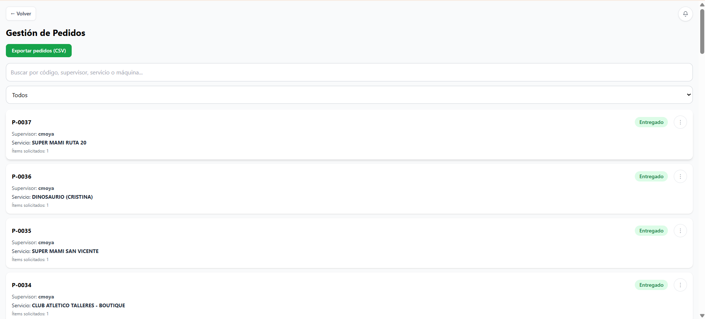

### 8.14 Eventuales

En **Eventuales**, el Administrador puede:

1. Ver eventuales recientes.
2. Abrir el historial completo.
3. Registrar un nuevo eventual.
4. Completar datos de un eventual.
5. Consultar detalle e historial.
6. Registrar componentes utilizados.
7. Registrar vehículos utilizados.
8. Registrar trabajos realizados.
9. Registrar servicios extras subcontratados.
10. Registrar observaciones posteriores.
11. Eliminar un eventual mediante baja lógica.
12. Descargar PDF resumen cuando el eventual está finalizado.

Al crear un eventual se cargan los datos base:

- Nombre.
- Supervisor (opcional al crear; es obligatorio asignarlo para completar maquinaria utilizada y trabajos realizados).
- Estado.
- Fecha de inicio.
- Fecha de fin.
- Observaciones previas.

Al completar datos o finalizar se pueden cargar:

- Máquinas utilizadas por tipo y cantidad.
- Vehículos utilizados.
- Trabajos realizados.
- Servicios extras subcontratados.
- Observaciones posteriores.

Estados de eventual:

- **activo**.
- **finalizado**.
- **cancelado**.

En el detalle de un eventual se visualiza:

- Supervisor responsable.
- Fechas de inicio y fin.
- Componentes utilizados.
- Vehículos utilizados.
- Trabajos realizados con cantidad y unidad.
- Servicios extras subcontratados.
- Observaciones previas.
- Observaciones posteriores.
- Historial de acciones.
- Datos legados de componentes, si existen.

La opción **Descargar PDF resumen** está disponible solo cuando el eventual está **finalizado**.

La opción **Eliminar eventual** realiza una baja lógica: el registro queda inactivo y se conserva en historial.

## 9. Funcionalidades del rol Coordinador

El Coordinador accede a un panel de lectura operativa con:

- **Máquinas**.
- **Vehículos**.
- **Taller**.
- **Eventuales**.

Puede consultar inventario, taller y eventuales sin editar datos maestros. En eventuales, cuando el flujo lo habilita, puede acceder a la acción de finalización para completar información posterior.

En general:

- Ve máquinas y vehículos en modo lectura, incluyendo filtros, históricos y datos de amortización.
- Ve taller y listados de elementos actualmente en taller.
- Ve eventuales, detalle, componentes, trabajos, servicios extras, observaciones e historial.
- Puede acceder a tipos de máquina y plazos de amortización en modo lectura.
- Puede finalizar eventuales desde la ruta habilitada para coordinación.

### 9.1 Finalizar eventual como Coordinador

Cuando el sistema habilita la finalización de un eventual:

1. Ingresar a **Eventuales**.
2. Abrir el eventual.
3. Seleccionar la acción de finalización.
4. Completar estado, fecha fin, componentes, trabajos realizados, servicios extras y observaciones posteriores.
5. Guardar.

La finalización queda registrada en el historial del eventual.

## 10. Funcionalidades del rol Consultor

El Consultor accede a información operativa en modo lectura.

Puede consultar:

- Máquinas.
- Vehículos.
- Taller.
- Eventuales.
- Servicios.
- Supervisores x Servicios.

No puede crear, editar, eliminar, importar ni ejecutar movimientos operativos.

En **Servicios** puede ver servicios y máquinas asociadas, pero no puede crear, editar ni dar de baja. En **Supervisores x Servicios** puede consultar qué servicios tiene asignado cada usuario operativo, sin modificar asignaciones.

## 11. Funcionalidades del rol Taller

### 11.1 Panel principal

El rol Taller accede a:

- **Máquinas**.
- **Vehículos**.
- **Taller**.

En máquinas y vehículos puede consultar inventario y ejecutar acciones de taller habilitadas.

Desde los listados de **Máquinas** y **Vehículos**, Taller puede usar accesos rápidos:

- **Ingreso taller:** cambia el estado a taller y registra movimiento.
- **Egreso taller:** registra salida de taller.

La edición de datos maestros permanece bloqueada para este rol.

### 11.2 Registrar ingreso o egreso de taller

En **Taller > Registrar Ingreso / Egreso**, el usuario elige si trabajará con máquinas o vehículos.

Para máquinas:

1. Ingresar a **Taller**.
2. Presionar **Registrar Ingreso / Egreso**.
3. Elegir **Máquinas**.
4. Buscar o filtrar por estado.
5. Seleccionar una o más máquinas.
6. Completar observación opcional.
7. Presionar **Registrar ingreso** o **Registrar egreso**.
8. Confirmar la transacción.

Para vehículos:

1. Ingresar a **Taller**.
2. Presionar **Registrar Ingreso / Egreso**.
3. Elegir **Vehículos**.
4. Buscar o filtrar por estado.
5. Seleccionar uno o más vehículos.
6. Completar observación opcional.
7. Presionar **Registrar ingreso** o **Registrar egreso**.
8. Confirmar la transacción.

Resultado esperado:

- Si se registra ingreso, el estado pasa a **taller**.
- Si se registra egreso, el elemento sale del estado **taller** según corresponda.
- El movimiento queda registrado en el historial.

### 11.3 Consultar lo que está en taller

En **Taller > Ver Taller**, el usuario puede consultar:

- Máquinas actualmente en taller.
- Vehículos actualmente en taller.
- Fecha de ingreso.
- Observaciones o datos disponibles del movimiento.

Las vistas **Ver Taller - Máquinas** y **Ver Taller - Vehículos** permiten buscar por datos del elemento:

- Máquinas: código, tipo, modelo, serie o servicio.
- Vehículos: ID, vehículo, patente, modelo o empresa.

También muestran el total actualmente en taller.

## 12. Flujo operativo de pedidos

### 12.1 Pedido a Depósito

1. El Supervisor crea un pedido con destino **Depósito**.
2. El pedido queda en **PENDIENTE_PREPARACION**.
3. Depósito asigna máquinas.
4. El pedido pasa a **PREPARADO**.
5. Depósito marca la entrega.
6. El pedido pasa a **ENTREGADO**.
7. El Supervisor registra la devolución.
8. El pedido pasa a **PENDIENTE_CONFIRMACION**.
9. Depósito confirma la devolución.
10. El pedido queda **CERRADO** o se registran faltantes.

### 12.2 Préstamo entre supervisores

1. Un Supervisor crea un pedido con destino **Supervisor**.
2. El supervisor receptor visualiza el pedido en **Mis préstamos**.
3. El receptor asigna máquinas o prepara el pedido.
4. El receptor entrega las máquinas.
5. Quien recibió las máquinas registra la devolución.
6. El receptor confirma la devolución.
7. El pedido se cierra o queda trazado con faltantes.

### 12.3 Faltantes y regularización

Cuando no se devuelve todo lo asignado:

1. El sistema exige justificación.
2. El receptor confirma solo lo efectivamente devuelto.
3. Las diferencias quedan en historial.
4. Si luego aparecen faltantes, la interfaz puede mostrar acciones de regularización como **Completar entrega**.

## 13. Estados principales

### 13.1 Estados de pedidos

| Estado | Significado operativo |
| --- | --- |
| PENDIENTE_PREPARACION | Pedido creado y pendiente de preparación o asignación |
| PREPARADO | Pedido preparado y listo para entrega |
| ENTREGADO | Máquinas entregadas al destinatario |
| PENDIENTE_CONFIRMACION | Devolución registrada y pendiente de confirmación |
| PENDIENTE_CONFIRMACION_FALTANTES | Devolución asociada a faltantes o diferencias |
| ENTREGA_CONFIRMADA | Estado de confirmación de entrega usado por el sistema cuando corresponde |
| CERRADO | Proceso del pedido finalizado |
| PENDIENTE_CANCELACION | Cancelación solicitada y pendiente de definición |
| CANCELADO | Pedido cancelado |

### 13.2 Estados de máquinas

| Estado | Significado operativo |
| --- | --- |
| disponible | Máquina disponible para asignar |
| asignada | Máquina vinculada a un pedido activo |
| no_devuelta | Máquina pendiente de regularización por devolución incompleta |
| fuera_servicio | Máquina no operativa |
| taller | Máquina ingresada a taller |
| baja | Máquina dada de baja |

### 13.3 Estados de vehículos

| Estado | Significado operativo |
| --- | --- |
| activo | Vehículo activo y disponible según su situación |
| asignada | Vehículo asociado a un uso o pedido activo |
| taller | Vehículo ingresado a taller |
| baja | Vehículo dado de baja |
| no_devuelta / fuera_servicio | Estados operativos especiales cuando apliquen |

### 13.4 Estados de eventuales

| Estado | Significado operativo |
| --- | --- |
| activo | Eventual vigente |
| finalizado | Eventual cerrado operativamente |
| cancelado | Eventual cancelado |

### 13.5 Estados de amortización

| Estado | Significado operativo |
| --- | --- |
| AMORTIZADA | La máquina cumplió el plazo definido |
| NO_AMORTIZADA | La máquina todavía no cumplió el plazo definido |
| SIN_DATOS | Faltan datos para calcular amortización |

## 14. Buenas prácticas de uso

Para una operación ordenada:

1. Crear siempre los pedidos desde el sistema.
2. Seleccionar correctamente destino, servicio y supervisor receptor.
3. Registrar observaciones cuando una entrega, devolución o movimiento tenga particularidades.
4. Justificar toda diferencia entre lo solicitado, entregado y devuelto.
5. Confirmar devoluciones solo con verificación física.
6. Mantener servicios, usuarios, máquinas, vehículos y seguros actualizados.
7. Revisar historial ante diferencias o reclamos.
8. Usar importaciones solo con plantillas actualizadas.
9. Verificar seguros y conductores antes de importar vehículos.
10. Confirmar movimientos masivos solo después de revisar el resumen.
11. No compartir credenciales.

## 15. Preguntas frecuentes

### 15.1 No veo un servicio al crear un pedido

Probablemente el usuario no tenga ese servicio asignado. Solicitar validación al Administrador.

### 15.2 No puedo seleccionar una máquina en la asignación

La máquina puede estar asignada, no devuelta, fuera de servicio, en taller o dada de baja.

### 15.3 Registré una devolución incompleta

El sistema solicitará justificación. Luego el receptor deberá confirmar la devolución y quedará trazabilidad del faltante.

### 15.4 ¿Qué diferencia hay entre Mis pedidos y Mis préstamos?

- **Mis pedidos:** pedidos creados por el usuario.
- **Mis préstamos:** pedidos recibidos desde otros supervisores.

### 15.5 ¿Qué hago si el sistema muestra que está iniciando y no avanza?

Esperar unos segundos y usar **Reintentar** si está disponible.

### 15.6 ¿Dónde veo el historial de un pedido?

En el detalle del pedido.

### 15.7 ¿Por qué no puedo editar una pantalla?

Puede ser una pantalla de solo lectura para el rol conectado. Coordinador, Consultor y Taller tienen restricciones según el módulo.

### 15.8 No puedo eliminar un seguro

Si el seguro tiene vehículos asociados, el sistema no permite eliminarlo.

### 15.9 No puedo eliminar un tipo de máquina o plazo de amortización

Los tipos con máquinas asociadas y los plazos con tipos asociados no se pueden eliminar hasta resolver esas relaciones.

### 15.10 La importación de vehículos fue rechazada

Revisar que el seguro exista, que no haya ID o patentes duplicadas, que las fechas estén bien cargadas y que el usuario informado como conductor exista.

### 15.11 La importación de máquinas muestra errores

Revisar la plantilla, los datos obligatorios, los tipos, servicios y formatos numéricos. La importación no debe confirmarse hasta corregir los errores.

### 15.12 ¿Por qué no puedo descargar el PDF de un eventual?

El PDF resumen está disponible solo cuando el eventual está en estado **finalizado**.

### 15.13 ¿Qué significa baja lógica?

Significa que el registro queda inactivo u oculto de la operación habitual, pero se conserva para trazabilidad e historial.

### 15.14 ¿Puedo mover máquinas con pedido activo en un movimiento masivo?

Sí, pero el sistema muestra una advertencia y solicita confirmación adicional porque el movimiento puede afectar información operativa de pedidos activos.

### 15.15 ¿Qué son las referencias de tipo de máquina?

Son imágenes con descripción asociadas a un tipo de máquina. Sirven para consulta visual o respaldo del catálogo.

### 15.16 No veo botones de crear, editar o eliminar

El rol conectado probablemente tiene permisos de lectura. Consultor, Coordinador y Taller tienen restricciones según pantalla.

## 16. Glosario

| Término | Definición |
| --- | --- |
| Pedido | Solicitud de máquinas creada en el sistema |
| Préstamo | Pedido cuyo destino es otro supervisor |
| Servicio | Área o frente operativo al que se vinculan máquinas, pedidos y permisos |
| Titular | Usuario o destino responsable del pedido en el flujo actual |
| Máquina fija | Máquina asociada al servicio habitual de un supervisor |
| Máquina temporal | Máquina vinculada a pedido activo o préstamo |
| Faltante | Máquina o vehículo que no fue devuelto o no pudo confirmarse |
| Taller | Estado y módulo donde se registran ingresos y egresos de reparación o control |
| Eventual | Registro operativo asociado a un supervisor, componentes, trabajos y servicios extras |
| Tipo de máquina | Categoría usada para agrupar máquinas y vehículos operativos |
| Referencia | Archivo asociado a un tipo de máquina |
| Plazo de amortización | Cantidad de meses usada para calcular el estado de amortización |
| Seguro | Catálogo de aseguradoras o coberturas asociadas a vehículos |
| Historial | Registro cronológico de acciones realizadas |
